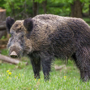
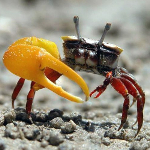
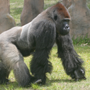
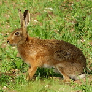
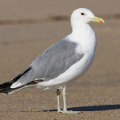
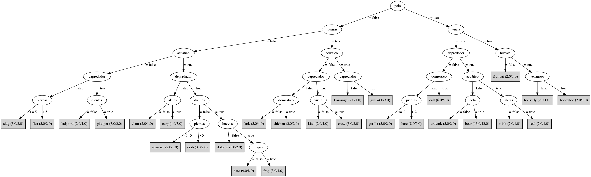

# ¿Cómo adivinar animales con un árbol de decisión?

Supongamos que se desea adivinar el animal en el que estás pensando...

### Escoge un animal de entre estos que aparecen en las fotografías:

     |      | 
-----------------------|------------------------|----------------------
 |   | 
     |   | 

### Vamos a utilizar un árbol para descubrir el animal seleccionado.

